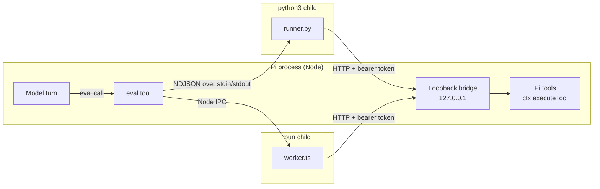
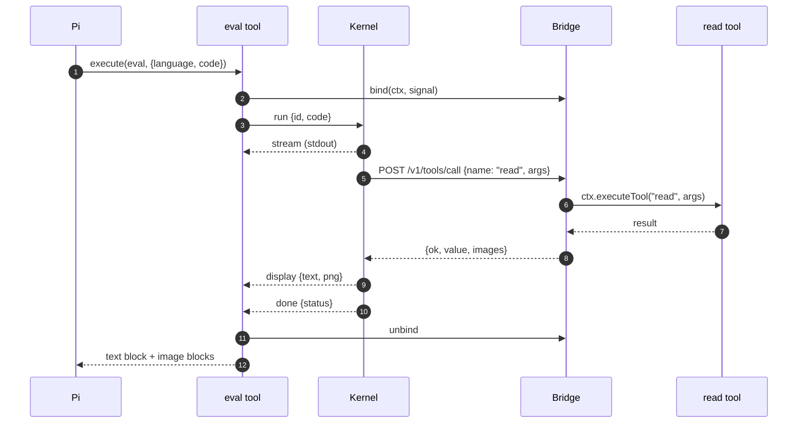
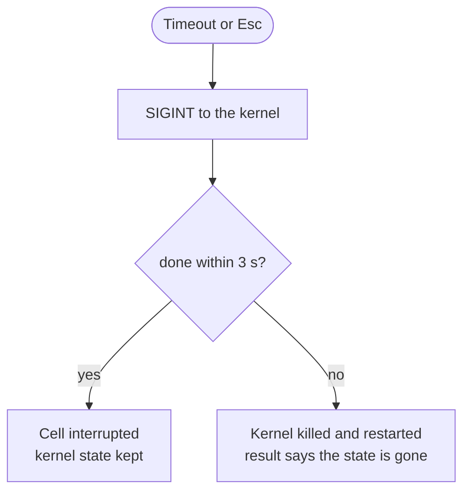
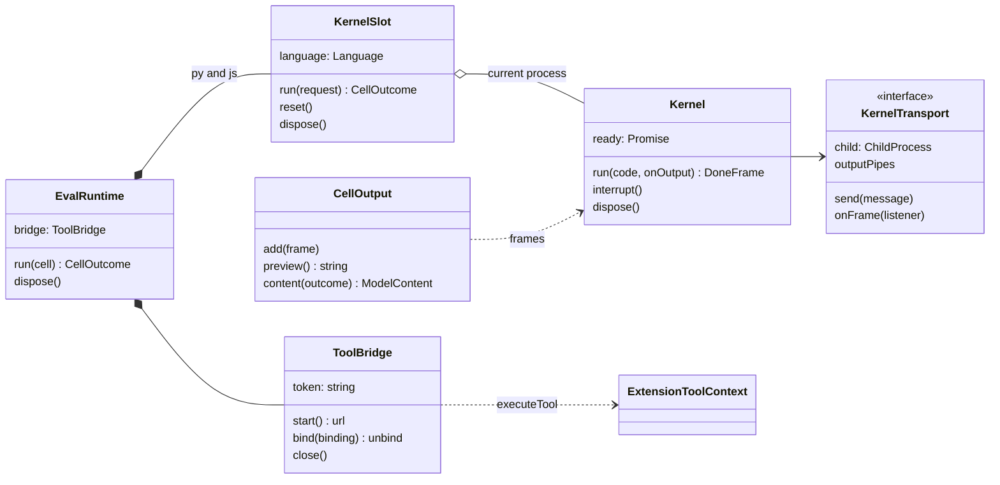

```text
 ⠀⠀⠀⠀⠀⠀⠀⠀⠀⠀⠀⠀⠀⠀⠀⠀⠀⠀⠀⠀⠀⠀⠀⠀⠀⠀⠀⠀⠀⠀⠀⠀⠀⠀⠀⠀⠀⠀⠀⠀⠀⠀⠀⠀⠀⠀⠀⠀⠀⠀⠀⠀⠀⠀⠀⠀⠀⠀⠀⠀⠀⠀⠀⠀⠀⠀⠀⠀⠀⠀⠀⠀⠀⠀⠀⠀⢀⢄⣀⣄⣄⣠⣴⣠⣀
 ⠀Persistent Python and Bun cells inside Pi, with tool calls from code.⠀⠀⠀⢠⢠⣲⣿⣿⣿⣿⣿⣿⣿⣿⣷⣶⣁⡀
 ⠀⠀⠀⠀⠀⠀⠀⠀⠀⠀⠀⠀⠀⠀⠀⠀⠀⠀⠀⠀⠀⠀⠀⠀⠀⠀⠀⠀⠀⠀⠀⠀⠀⠀⠀⠀⠀⠀⠀⠀⠀⠀⠀⠀⠀⠀⠀⠀⠀⠀⠀⠀⠀⠀⠀⠀⠀⠀⠀⠀⠀⠀⠀⠀⠀⠀⠀⠀⠀⠀⠀⠀⠀⢔⣿⣿⣿⣿⣿⣿⣿⣿⣿⣿⣿⣿⣿⣥⣀
 ⠀pi install git:github.com/josemartinrodriguezmortaloni/pi-codesansbox⠀⠀⣸⣾⣿⣿⣿⣿⣿⢿⣿⡿⣿⣿⣿⣿⣿⣿⣯⠆
 ⠀⠀⠀⠀⠀⠀⠀⠀⠀⠀⠀⠀⠀⠀⠀⠀⠀⠀⠀⠀⠀⠀⠀⠀⠀⠀⠀⠀⠀⠀⠀⠀⠀⠀⠀⠀⠀⠀⠀⠀⠀⠀⠀⠀⠀⠀⠀⠀⠀⠀⠀⠀⠀⠀⠀⠀⠀⠀⠀⠀⠀⠀⠀⠀⠀⠀⠀⠀⠀⠀⠀⠀⠈⣿⣿⣿⢿⠇⠟⠅⠛⠓⠳⡻⣟⢿⣿⣿⠓⠁
 ⠀⚠ Status: 0.1.0. Built and tested on Pi 0.99.2 and Bun 1.3.13.⠀⠀⠀⠀⠀⠀⠀⠀⠀⠀⠚⢿⣿⣯⡇⠀⠀⡘⠄⠀⢀⣷⣿⠻⠹
 ⠀⠀⠀⠀⠀⠀⠀⠀⠀⠀⠀⠀⠀⠀⠀⠀⠀⠀⠀⠀⠀⠀⠀⠀⠀⠀⠀⠀⠀⠀⠀⠀⠀⠀⠀⠀⠀⠀⠀⠀⠀⠀⠀⠀⠀⠀⠀⠀⠀⠀⠀⠀⠀⠀⠀⠀⠀⠀⠀⠀⠀⠀⠀⠀⠀⠀⠀⠀⠀⠀⠀⠀⠀⠀⠀⠁⡙⠗⣄⡜⠄⡒⠊⡜⠟⠁
 ⠀⠀⠀⠀⠀⠀⠀⠀⠀⠀⠀⠀⠀⠀⠀⠀⠀⠀⠀⠀⠀⠀⠀⠀⠀⠀⠀⠀⠀⠀⠀⠀⠀⠀⠀⠀⠀⠀⠀⠀⠀⠀⠀⠀⠀⠀⠀⠀⠀⠀⠀⠀⠀⠀⠀⠀⠀⠀⠀⠀⠀⠀⠀⠀⠀⠀⠀⠀⠀⠀⠀⠀⠀⠀⣀⣠⠅⣰⠅⡑⠆⠄⡊⠆⠠⠱⠠⣀⡀
 ⠀⠀⠀⠀⠀⠀⠀⠀⠀⠀⠀⠀⠀⠀⠀⠀⠀⠀⠀⠀⠀⠀⠀⠀⠀⠀⠀⠀⠀⠀⠀⠀⠀⠀⠀⠀⠀⠀⠀⠀⠀⠀⠀⠀⠀⠀⠀⠀⠀⠀⠀⠀⠀⠀⠀⠀⠀⠀⠀⠀⠀⠀⠀⠀⠀⠀⠀⠔⣺⢾⣞⠞⡞⣛⣟⡁⠀⠈⠢⠠⠀⠘⠀⡅⠀⢈⣴⠊
 ⠀⠀⠀⠀⠀⠀⠀⠀⠀⠀⠀⠀⠀⠀⠀⠀⠀⠀⠀⠀⠀⠀⠀⠀⠀⠀⠀⠀⠀⠀⠀⠀⠀⠀⠀⠀⠀⠀⠀⠀⠀⠀⠀⠀⠀⠀⠀⠀⠀⠀⠀⠀⠀⠀⠀⠀⠀⠀⠀⠀⠀⠀⠀⠀⠀⠀⢠⣧⣢⡚⢹⡌⡂⡊⡒⠪⠹⣟⠂⣈⣈⠀⠂⠜⡨⢟⠟⠿⢷⣄⣀
 ⠀⠀⠀⠀⠀⠀⠀⠀⠀⠀⠀⠀⠀⠀⠀⠀⠀⠀⠀⠀⠀⠀⠀⠀⠀⠀⠀⠀⠀⠀⠀⠀⠀⠀⠀⠀⠀⠀⠀⠀⠀⠀⠀⠀⠀⠀⠀⠀⠀⠀⠀⠀⠀⠀⠀⠀⠀⠀⠀⠀⠀⠀⠀⠀⠀⢸⠝⠻⣙⢕⢑⢽⣂⢪⢂⡡⡃⡊⢷⡀⠈⢧⠞⣫⠀⢱⢪⠸⠰⠡⠩⣻⣆
 ⠀⠀⠀⠀⠀⠀⠀⠀⠀⠀⠀⠀⠀⠀⠀⠀⠀⠀⠀⠀⠀⠀⠀⠀⠀⠀⠀⠀⠀⠀⠀⠀⠀⠀⠀⠀⠀⠀⠀⠀⠀⠀⠀⠀⠀⠀⠀⠀⠀⠀⠀⠀⠀⠀⠀⠀⠀⠀⠀⠀⠀⠀⠀⠀⠀⢼⣿⢚⠴⠡⡊⣺⡖⢑⢔⢔⢔⡠⢁⢧⡀⠀⢻⣷⠀⠸⣹⢌⡪⡊⡪⣸⢷
 ⠀⠀⠀⠀⠀⠀⠀⠀⠀⠀⠀⠀⠀⠀⠀⠀⠀⠀⠀⠀⠀⠀⠀⠀⠀⠀⠀⠀⠀⠀⠀⠀⠀⠀⠀⠀⠀⠀⠀⠀⠀⠀⠀⠀⠀⠀⠀⠀⠀⠀⠀⠀⠀⠀⠀⠀⠀⠀⠀⠀⠀⠀⠀⢀⡜⣽⠵⡹⢰⣱⣼⣾⣷⡡⢔⢑⡠⢪⠨⢒⢥⡐⠈⣿⡂⠂⠇⡰⠉⣖⡈⡎⢹
 ⠀⠀⠀⠀⠀⠀⠀⠀⠀⠀⠀⠀⠀⠀⠀⠀⠀⠀⠀⠀⠀⠀⠀⠀⠀⠀⠀⠀⠀⠀⠀⠀⠀⠀⠀⠀⠀⠀⠀⠀⠀⠀⠀⠀⠀⠀⠀⠀⠀⠀⠀⠀⠀⠀⠀⠀⠀⠀⠀⠀⠀⠀⢰⣟⡜⣪⣌⣾⣿⣿⠿⣿⣿⡢⣅⡊⢢⠈⠜⡢⣁⠽⢶⣽⣧⠞⠁⡸⢠⡣⡐⣇⠏
 ⠀⠀⠀⠀⠀⠀⠀⠀⠀⠀⠀⠀⠀⠀⠀⠀⠀⠀⠀⠀⠀⠀⠀⠀⠀⠀⠀⠀⠀⠀⠀⠀⠀⠀⠀⠀⠀⠀⠀⠀⠀⠀⠀⠀⠀⠀⠀⠀⠀⠀⠀⠀⠀⠀⠀⠀⠀⠀⠀⠀⠀⣤⣾⣿⣾⡿⢻⣿⠟⠀⠀⠘⢿⣷⣽⡮⠨⡨⡊⣢⣊⣌⢮⢛⠅⠚⢂⣸⠞⠄⣺⣟⠦
 ⠀⠀⠀⠀⠀⠀⠀⠀⠀⠀⠀⠀⠀⠀⠀⠀⠀⠀⠀⠀⠀⠀⠀⠀⠀⠀⠀⠀⠀⠀⠀⠀⠀⠀⠀⠀⠀⠀⠀⠀⠀⠀⠀⠀⠀⠀⠀⠀⠀⠀⠀⠀⠀⠀⠀⠀⠀⠀⠀⣠⡞⡪⢽⣻⣿⠃⡼⠃⠀⠀⠀⠀⠘⣿⣿⣿⣥⡢⢴⣛⣺⠺⠶⡾⠾⠿⡻⠡⡊⣪⣿⡺⠁
 ⠀⠀⠀⠀⠀⠀⠀⠀⠀⠀⠀⠀⠀⠀⠀⠀⠀⠀⠀⠀⠀⠀⠀⠀⠀⠀⠀⠀⠀⠀⠀⠀⠀⠀⠀⠀⠀⠀⠀⠀⠀⠀⠀⠀⠀⠀⠀⠀⠀⠀⠀⠀⠀⠀⠀⠀⠀⢠⠪⣪⠊⡀⠠⡸⠃⠨⢆⠀⠀⠀⠀⠀⠀⠘⢿⣿⣿⢭⡓⡳⢣⣢⣡⣆⣥⣥⣖⢟⣨⣾⡇
 ⠀⠀⠀⠀⠀⠀⠀⠀⠀⠀⠀⠀⠀⠀⠀⠀⠀⠀⠀⠀⠀⠀⠀⠀⠀⠀⠀⠀⠀⠀⠀⠀⠀⠀⠀⠀⠀⠀⠀⠀⠀⠀⠀⠀⠀⠀⠀⠀⠀⠀⠀⠀⠀⠀⠀⠀⠀⢱⣺⡁⡂⠠⢠⠂⡰⠢⠢⢱⠂⠀⠀⠀⠀⠀⠀⣿⣿⣽⣮⣽⣎⣲⣹⣥⣷⣾⣾⢿⣿⣿⡇
 ⠀⠀⠀⠀⠀⠀⠀⠀⠀⠀⠀⠀⠀⠀⠀⠀⠀⠀⠀⠀⠀⠀⠀⠀⠀⠀⠀⠀⠀⠀⠀⠀⠀⠀⠀⠀⠀⠀⠀⠀⠀⠀⠀⠀⠀⠀⠀⠀⠀⠀⠀⠀⠀⠀⠀⠀⠀⠀⢷⡱⣤⣂⣠⠃⠀⠀⣘⡪⠀⠀⠀⠀⠀⠀⠀⣾⣥⣳⣇⡺⣌⠍⣻⢻⠛⠍⡊⢜⣿⡍⣓⣦⡀
 ⠀⠀⠀⠀⠀⠀⠀⠀⠀⠀⠀⠀⠀⠀⠀⠀⠀⠀⠀⠀⠀⠀⠀⠀⠀⠀⠀⠀⠀⠀⠀⠀⠀⠀⠀⠀⠀⠀⠀⠀⠀⠀⠀⠀⠀⠀⠀⠀⠀⠀⠀⠀⠀⠀⠀⠀⠀⠀⠀⠈⠉⠉⠀⠸⣈⡨⠔⠀⠀⠀⠀⠀⠀⠀⢰⣿⢟⢻⣷⡘⣷⡝⣔⢔⡡⡃⢪⣲⢽⡿⡱⠢⣑⠆⡀
 ⠀⠀⠀⠀⠀⠀⠀⠀⠀⠀⠀⠀⠀⠀⠀⠀⠀⠀⠀⠀⠀⠀⠀⠀⠀⠀⠀⠀⠀⠀⠀⠀⠀⠀⠀⠀⠀⠀⠀⠀⠀⠀⠀⠀⠀⠀⠀⠀⠀⠀⠀⠀⠀⠀⠀⠀⠀⠀⠀⠀⠀⠀⠀⠀⠀⠀⠀⠀⠀⠀⠀⠀⠀⠀⣾⡇⢝⣷⣿⣧⣲⡡⡊⣳⣢⡾⣻⠽⠩⣻⣊⠑⢎⡣⡇
 ⠀⠀⠀⠀⠀⠀⠀⠀⠀⠀⠀⠀⠀⠀⠀⠀⠀⠀⠀⠀⠀⠀⠀⠀⠀⠀⠀⠀⠀⠀⠀⠀⠀⠀⠀⠀⠀⠀⠀⠀⠀⠀⠀⠀⠀⠀⠀⠀⠀⠀⠀⠀⠀⠀⠀⠀⠀⠀⠀⠀⠀⠀⠀⠀⠀⠀⠀⠀⠀⠀⠀⠀⠀⣴⡿⢚⠘⡹⠻⣷⣖⢍⠙⡹⠿⣛⢕⢑⢅⢽⠠⠀⣧⠗⠁
 ⠀⠀⠀⠀⠀⠀⠀⠀⠀⠀⠀⠀⠀⠀⠀⠀⠀⠀⠀⠀⠀⠀⠀⠀⠀⠀⠀⠀⠀⠀⠀⠀⠀⠀⠀⠀⠀⠀⠀⠀⠀⠀⠀⠀⠀⠀⠀⠀⠀⠀⠀⠀⠀⠀⠀⠀⠀⠀⠀⠀⠀⠀⠀⠀⠀⠀⠀⠀⠀⠀⠀⠀⠰⣿⣿⣬⣪⠨⢪⣼⣿⣮⠨⡨⡨⡂⡪⠨⣲⣿⠂⠔⠁
 ⠀⠀⠀⠀⠀⠀⠀⠀⠀⠀⠀⠀⠀⠀⠀⠀⠀⠀⠀⠀⠀⠀⠀⠀⠀⠀⠀⠀⠀⠀⠀⠀⠀⠀⠀⠀⠀⠀⠀⠀⠀⠀⠀⠀⠀⠀⠀⠀⠀⠀⠀⠀⠀⠀⠀⠀⠀⠀⠀⠀⠀⠀⠀⠀⠀⠀⠀⠀⠀⠀⠀⠀⠀⠈⣿⢿⣿⣿⣿⣿⣿⣿⣥⠊⡂⡪⣨⣾⣻⣿⡲⠁
 ⠀⠀⠀⠀⠀⠀⠀⠀⠀⠀⠀⠀⠀⠀⠀⠀⠀⠀⠀⠀⠀⠀⠀⠀⠀⠀⠀⠀⠀⠀⠀⠀⠀⠀⠀⠀⠀⠀⠀⠀⠀⠀⠀⠀⠀⠀⠀⠀⠀⠀⠀⠀⠀⠀⠀⠀⠀⠀⠀⠀⠀⠀⠀⠀⠀⠀⠀⠀⠀⠀⠀⠀⠀⣰⡟⣨⠲⢕⣍⡙⣟⡟⢿⣧⣡⡖⣿⢇⣇⣿⡆
 ⠀⠀⠀⠀⠀⠀⠀⠀⠀⠀⠀⠀⠀⠀⠀⠀⠀⠀⠀⠀⠀⠀⠀⠀⠀⠀⠀⠀⠀⠀⠀⠀⠀⠀⠀⠀⠀⠀⠀⠀⠀⠀⠀⠀⠀⠀⠀⠀⠀⠀⠀⠀⠀⠀⠀⠀⠀⠀⠀⠀⠀⠀⠀⠀⠀⠀⠀⠀⠀⠀⠀⠀⠀⢽⣦⣂⢮⣪⣩⡛⢮⢎⢎⣾⣟⣾⣯⣿⢿⣿⠂
 ⠀⠀⠀⠀⠀⠀⠀⠀⠀⠀⠀⠀⠀⠀⠀⠀⠀⠀⠀⠀⠀⠀⠀⠀⠀⠀⠀⠀⠀⠀⠀⠀⠀⠀⠀⠀⠀⠀⠀⠀⠀⠀⠀⠀⠀⠀⠀⠀⠀⠀⠀⠀⠀⠀⠀⠀⠀⠀⠀⠀⠀⠀⠀⠀⠀⠀⠀⠀⠀⠀⠀⠀⣰⡟⡫⠹⣓⢟⠻⣛⣿⠟⣷⣿⣿⣿⢟⠻⣿⠇
 ⠀⠀⠀⠀⠀⠀⠀⠀⠀⠀⠀⠀⠀⠀⠀⠀⠀⠀⠀⠀⠀⠀⠀⠀⠀⠀⠀⠀⠀⠀⠀⠀⠀⠀⠀⠀⠀⠀⠀⠀⠀⠀⠀⠀⠀⠀⠀⠀⠀⠀⠀⠀⠀⠀⠀⠀⠀⠀⠀⠀⠀⠀⠀⠀⠀⠀⠀⠀⠀⠀⠀⢠⣿⡚⡸⡠⠢⡡⢢⡞⠁⠀⣾⣿⣿⠅⡪⣸⣿
```

pi-eval-kernels is a [Pi](https://github.com/earendil-works/pi) extension that registers the `eval` tool. The model writes a cell of Python or JavaScript; the extension runs it in a persistent kernel and returns the output, the trailing value and the figures. Code inside a cell calls the agent's own tools, `tool.read`, `tool.write`, `tool.bash` or any MCP tool, over a loopback bridge that Pi checks like any other tool call.

It brings the `eval` tool of [oh-my-pi](https://github.com/can1357/oh-my-pi) to Pi. The model loads a CSV with `tool.read` from Python, charts it from JavaScript, and the chart comes back as an image without leaving the cell.

## Highlights

- **Notebook state:** variables, functions and imports persist between cells; each session has one Python kernel and one Bun kernel
- **Your tools from code:** `tool.read(path=...)` in Python, `await tool.read({ path })` in JavaScript; every tool the session can call, found at run time, not from a fixed list
- **Pi still decides:** nested calls run through `ctx.executeTool`, so argument validation, `tool_call` hooks and permission extensions see them
- **Figures inline:** matplotlib figures and SVG charts come back as PNG images, to the model and to the TUI
- **Interrupts that keep state:** a timeout or `Esc` sends `SIGINT`; the cell stops and the kernel keeps its variables
- **No orphans:** kernels live in their own process groups and stop with the session, with Pi, or when Pi is killed
- **Loopback only:** the bridge listens on `127.0.0.1` and checks a per-session token that never enters the environment

<p>
  <a href="https://github.com/earendil-works/pi"></a>
  <a href="https://www.python.org"></a>
  <a href="https://bun.sh"></a>
  <a href="https://www.typescriptlang.org"></a>
  <a href="https://github.com/josemartinrodriguezmortaloni/pi-codesansbox/commits/main"></a>
</p>

## Install

You need:

- **Pi 0.99.2** (`pi --version`).
- **Python 3** on the `PATH` as `python3`. No Jupyter and no ipykernel. matplotlib only if you want figures.
- **Bun** on the `PATH`. The JavaScript kernel runs on Bun; the extension itself runs inside Pi on Node.

```bash
pi install git:github.com/josemartinrodriguezmortaloni/pi-codesansbox
```

Pi clones the repo and installs its two runtime dependencies, `acorn` and `@resvg/resvg-js`. The package lands in `~/.pi/agent/settings.json`; add `-l` to install it for the current project only. To install from a clone:

```bash
git clone https://github.com/josemartinrodriguezmortaloni/pi-codesansbox.git
cd pi-codesansbox
bun install
pi install "$PWD"
```

To try it for one run without changing settings, use `pi -e "$PWD"` from the clone.

## Get started

Ask for something that needs code. The model calls `eval` on its own:

```text
Load sales.csv, add up the revenue per month, and chart it.
```

Each call is one cell:

```ts
eval({ language: "py" | "js", code: string, title?: string, timeout?: number, reset?: boolean })
```

| Parameter  | Meaning                                                                                      |
| ---------- | -------------------------------------------------------------------------------------------- |
| `language` | `"py"` runs in the Python kernel, `"js"` in the Bun kernel                                   |
| `code`     | The cell. A trailing expression is shown: `repr()` in Python, `util.inspect()` in JavaScript |
| `title`    | A short label in the TUI                                                                     |
| `timeout`  | Seconds before the cell is interrupted. `120` by default; `0` turns it off                   |
| `reset`    | Restart this language's kernel first, without its state                                      |

The reference demo, as two cells:

```python
# eval language="py"
import csv, io, json
rows = list(csv.DictReader(io.StringIO(tool.read(path="sales.csv"))))
totals = {}
for row in rows:
    totals[row["month"]] = totals.get(row["month"], 0) + int(row["revenue"])
tool.write(path="totals.json", content=json.dumps(totals))
totals
```

```javascript
// eval language="js"
const totals = JSON.parse(await tool.read({ path: "totals.json" }));
const bars = Object.entries(totals)
  .map(
    ([month, value], i) =>
      `<rect x="${40 + i * 90}" y="${230 - value / 2}" width="60" height="${value / 2}" fill="#4c78a8"/>`,
  )
  .join("");
await display.svg(
  `<svg xmlns="http://www.w3.org/2000/svg" width="320" height="260">${bars}</svg>`,
);
```

In the TUI, a cell reads like a notebook cell: the code, then stdout, warnings, the trailing value, and the figure drawn inline:

```text
eval py
fig, (left, right) = plt.subplots(1, 2, figsize=(12, 7))
…
plt.show()
fig

plotted 2 axes
<cell-3>:5: UserWarning: The figure layout has changed to tight
<Figure size 1200x700 with 2 Axes>
[the chart, inline]
```

## Configuration

The extension has no settings file. It reads these sources:

| Source                         | Use                                                                                       |
| ------------------------------ | ----------------------------------------------------------------------------------------- |
| `PI_EVAL_PYTHON`               | Python interpreter of the Python kernel. Without it, `python3` on the `PATH`              |
| `PI_EVAL_BUN`                  | Bun executable of the JavaScript kernel. Without it, `bun` on the `PATH`                  |
| `PYTHONPATH`                   | Kept; the extension puts its own `python/` directory first                                |
| `MPLBACKEND`                   | Replaced with the inline backend in the Python kernel, so `plt.show()` returns the figure |
| Pi `showImages` setting        | Whether the TUI draws the figures. The model receives them either way                     |
| `$TMPDIR/pi-eval-*/output.txt` | Output, not input: the full text of a cell whose output was truncated                     |

## How it works

The extension owns one bridge and two kernel slots per Pi session. Nothing starts when the extension loads: the first cell of a language starts that kernel and the bridge.



### A cell

Both kernels speak the same frames: `ready`, `stream`, `display` and `done`. The extension turns them into one tool result and streams the partial output to the TUI while the cell runs.



- The text block holds stdout, stderr, warnings, tracebacks and shown values, in the order the kernel wrote them.
- Long text keeps its tail for the model; the full text goes to a file that the result names.
- A nested tool returns its `structuredContent` when it declares an `outputSchema`, and its text otherwise: the same rule as Pi's `codemode`.
- Images in a nested result, such as `tool.read` of a PNG, become images of the cell.

### Kernels

|               | Python                                                                                               | JavaScript                                                                                                  |
| ------------- | ---------------------------------------------------------------------------------------------------- | ----------------------------------------------------------------------------------------------------------- |
| Process       | `python3 -u python/runner.py`, no IPython                                                            | `bun src/js/worker.ts`                                                                                      |
| State         | One namespace for the session; top-level `await` works                                               | `vm.runInThisContext`; top-level `const`, `let` and `class` become `var` so a cell can declare a name again |
| Call a tool   | `tool.read(path="x")`, `tool["name"]({...})`, synchronous                                            | `await tool.read({ path: "x" })`                                                                            |
| List tools    | `list_tools()`                                                                                       | `await listTools()`                                                                                         |
| A failed call | raises `ToolError`                                                                                   | rejects with `ToolError`                                                                                    |
| Images        | `plt.show()`, a trailing figure, figures still open at the end, `display(obj)`, `display_png(bytes)` | `await display.svg(svg)`, `display.png(bytes)`, `display(value)`                                            |

`eval` has the `model-only` exposure: a cell can call every tool the session exposes to tools, but never `eval`, so a cell cannot start another cell.

### Interrupts

A timeout or an aborted run sends `SIGINT` to the kernel's process group:



- Python raises `KeyboardInterrupt` inside the cell.
- JavaScript stops synchronous code through `breakOnSigint`, and abandons a cell that waits on a promise.
- A JavaScript busy loop that starts after an `await` ignores `SIGINT`, so that kernel restarts.

### Cleanup

| Event                                          | What stops the kernels                                                  |
| ---------------------------------------------- | ----------------------------------------------------------------------- |
| `session_shutdown` (quit, new session, reload) | An `exit` message, then `SIGTERM`, then `SIGKILL` to each process group |
| Pi exits without a shutdown                    | An `exit` hook sends `SIGKILL` to the process groups                    |
| Pi is killed with `SIGKILL`                    | Each kernel sees its parent change and exits within a second            |

Child processes that cell code starts belong to the kernel's process group, so they stop with it.

### Security

- The bridge listens on `127.0.0.1`, on a random port.
- Every request needs `Authorization: Bearer <token>`. The token is 256 random bits per session, compared in constant time.
- The token reaches the kernel as its first protocol message, over stdin or IPC. Other processes of your user cannot read it in `/proc/<pid>/environ`.
- Outside a running cell, the bridge answers `409` to every call.
- Cell code runs with your permissions and without a sandbox: treat `eval` like `bash`.

## Architecture

Each module owns one reason to change. `index.ts` only registers the tool and wires `session_shutdown`.

| Module                        | Owns                                                               | Changes when                         |
| ----------------------------- | ------------------------------------------------------------------ | ------------------------------------ |
| `index.ts`                    | Tool registration and the session's runtime lifetime               | Pi's extension lifecycle changes     |
| `eval-tool.ts`                | Schema, model-facing description, result assembly, partial updates | The tool contract changes            |
| `runtime.ts`                  | One bridge and one slot per language for a session                 | A language is added                  |
| `bridge.ts`                   | Loopback HTTP, token check, dispatch to `ctx.executeTool`          | Pi's nested-call contract changes    |
| `cell-output.ts`              | Frames → text and image blocks, truncation, status notes           | What the model receives changes      |
| `render.ts`                   | `renderCall` and `renderResult` in the TUI                         | The transcript design changes        |
| `kernel/kernel.ts`            | One kernel process, its frames, process-group signals              | The frame protocol changes           |
| `kernel/transports.ts`        | How each kernel is spawned and talked to                           | A runtime's spawn or channel changes |
| `kernel/slot.ts`              | Lazy start, deadlines, interrupt escalation, restart               | The interrupt policy changes         |
| `js/worker.ts`                | The Bun kernel: execution, console capture, `tool`, `display`      | The JavaScript cell semantics change |
| `js/rewrite.ts`               | Top-level bindings, imports and the trailing value of a cell       | The REPL rewrite rules change        |
| `python/runner.py`            | The Python kernel: execution, streams, display, `tool`             | The Python cell semantics change     |
| `python/pi_inline_backend.py` | `plt.show()` → figure frames                                       | matplotlib's backend API changes     |



## Limits

- Under the `claude-acp` provider, Claude Code works with its own tools and never sees `eval`. The tool reaches models that Pi drives directly.
- The two kernels share no memory. Pass data through files or tool calls.
- One cell runs at a time: `eval` runs in sequence with other tools.
- In Python, `tool.<name>()` blocks the cell. oh-my-pi makes it awaitable.
- The cell timeout keeps counting while a nested tool call runs.
- JavaScript cells are JavaScript, not TypeScript.
- Not ported from oh-my-pi: the `agent`, `completion`, `judge`, `workpool` and `budget` helpers, and Python magics. Pi has no subsystems behind them.

[`TASKS.md`](TASKS.md) maps each part of oh-my-pi's `eval` to the Pi API that replaces it, with file and line on both sides.

## Development

```bash
bun install
pi -e "$PWD"   # load the working tree in Pi
```

Gate every change before a commit:

| Command              | Checks                                                                                             |
| -------------------- | -------------------------------------------------------------------------------------------------- |
| `bun run typecheck`  | `tsc --noEmit`, strict                                                                             |
| `bun run complexity` | `lizard -C 3` over `src`, `python` and `test`: cyclomatic complexity < 4 per function. Needs `uvx` |
| `bun run test`       | `node:test` against real Pi sessions with a scripted faux model, and one run of the `pi` CLI       |
| `bun run check`      | All three, in that order                                                                           |

The tests load this package from disk, the same way `pi -e` does. The CLI test runs `pi --mode json` with its own `PI_CODING_AGENT_DIR`, so it never reads your settings. Set `PI_BIN` to test another `pi` binary.

## Credits

Built on [Pi](https://github.com/earendil-works/pi) by Earendil. The design of the kernels and the bridge comes from the `eval` tool of [oh-my-pi](https://github.com/can1357/oh-my-pi) by Can Bölük, under the MIT license; see [`NOTICE`](NOTICE). Cells are parsed with [acorn](https://github.com/acornjs/acorn), and SVG charts are rendered with [resvg-js](https://github.com/thx/resvg-js). The banner is a braille rendering of Spike Spiegel from _Cowboy Bebop_ (© Sunrise), made from the character art in IGN's [The Many Inspirations of Cowboy Bebop Director Shinichiro Watanabe](https://sea.ign.com/cowboy-bebop-2/125472/the-many-inspirations-of-cowboy-bebop-director-shinichiro-watanabe).
