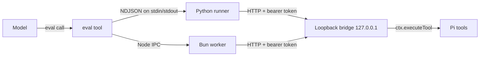

# pi-eval-kernels

A [Pi](https://github.com/earendil-works/pi) extension that adds an `eval` tool: notebook-style cells that run in a persistent Python kernel or a persistent Bun (JavaScript) kernel. Code in either kernel can call the agent's own tools (`read`, `write`, `bash`, MCP tools, and so on) over an authenticated loopback bridge.

It reproduces the `eval` tool of [oh-my-pi](https://github.com/can1357/oh-my-pi) on Pi 0.99.2.

```python
# eval language="py": load a CSV through the agent's read tool
import csv, io, json
rows = list(csv.DictReader(io.StringIO(tool.read(path="sales.csv"))))
totals = {}
for row in rows:
    totals[row["month"]] = totals.get(row["month"], 0) + int(row["revenue"])
tool.write(path="totals.json", content=json.dumps(totals))
totals
```

```javascript
// eval language="js": chart the result; the PNG reaches the model and the TUI
const totals = JSON.parse(await tool.read({ path: "totals.json" }));
const bars = Object.entries(totals).map(([month, value], i) =>
  `<rect x="${40 + i * 90}" y="${230 - value / 2}" width="60" height="${value / 2}" fill="#4c78a8"/>`).join("");
await display.svg(`<svg xmlns="http://www.w3.org/2000/svg" width="320" height="260">${bars}</svg>`);
```

## Requirements

| Component | Version | Notes |
|---|---|---|
| Pi | 0.99.2 or later | Runs the extension on Node.js. |
| Python | 3.x on `PATH` as `python3` | Override with `PI_EVAL_PYTHON`. No Jupyter or ipykernel needed. matplotlib is optional and only needed for figures. |
| Bun | on `PATH` as `bun` | Override with `PI_EVAL_BUN`. |

## Install

1. Install the runtime dependencies (`acorn`, `@resvg/resvg-js`):

   ```sh
   cd /path/to/pi-codesanbox-execution
   bun install
   ```

2. Try the extension for one run, without changing your settings:

   ```sh
   pi -e /path/to/pi-codesanbox-execution
   ```

3. Activate it permanently. This adds the package to `~/.pi/agent/settings.json`:

   ```sh
   pi install /path/to/pi-codesanbox-execution
   ```

   `pi list` then shows the package. Add `-l` to install it only for the current project.

## The `eval` tool

```ts
eval({ language: "py" | "js", code: string, title?: string, timeout?: number, reset?: boolean })
```

| Parameter | Meaning |
|---|---|
| `language` | `"py"` runs in the Python kernel, `"js"` in the Bun kernel. |
| `code` | Cell source. The value of a trailing expression is displayed: `repr()` in Python, `util.inspect()` in JavaScript. |
| `title` | Short label shown in the TUI. |
| `timeout` | Seconds before the cell is interrupted. Default `120`; `0` disables it. |
| `reset` | Restart this language's kernel before running, discarding its state. |

### State

Each session has one kernel per language. Variables, functions, classes, and imports defined in a cell stay available in later cells of the same language. The two kernels do not share memory; pass data through files or tool calls.

In JavaScript, top-level `const`, `let`, and `class` declarations are rewritten to `var`, so a later cell can declare the same name again, like a REPL. Top-level `await` and static `import` statements work. Relative and bare specifiers resolve from the session's working directory.

### Calling the agent's tools

| | Python | JavaScript |
|---|---|---|
| Call a tool | `tool.read(path="x")` or `tool["name"]({...})` (synchronous) | `await tool.read({ path: "x" })` |
| List callable tools | `list_tools()` | `await listTools()` |
| Failed, blocked, or invalid call | raises `ToolError` | rejects with `ToolError` |

Tools are discovered at call time, not from a fixed list. Every tool Pi lets one tool call from another (`ctx.tools`) is reachable: active built-in tools, tools from other extensions, and `codemode`/`deferred` tools such as MCP tools. `eval` itself is not reachable, so a cell cannot start another cell.

A tool returns its `structuredContent` when it declares an `outputSchema`, and its text otherwise. This is the same rule Pi's `codemode` uses. Images in a nested result, for example `tool.read` of a PNG, become images of the cell.

Nested calls go through `ctx.executeTool()`. Pi's argument validation, `tool_call`/`tool_result` hooks, and permission extensions apply to them exactly as to calls the model makes.

### Output and images

Each cell returns one text block followed by one image block per image:

- The text block holds stdout, stderr (including Python warnings and tracebacks), and displayed values in the order they were produced.
- Long text is truncated to the tail, and the full output is written to a temporary file whose path the result names.

| | Python | JavaScript |
|---|---|---|
| Figures | `plt.show()`, a trailing figure expression, and every figure still open when the cell ends | `await display.svg(svgString, { width? })` rasterizes SVG to PNG |
| Raw PNG | `display_png(bytes_or_base64)` | `display.png(bytesOrBase64)` |
| Any value | `display(obj)` (uses `_repr_png_` when present) | `display(value)` |

The images reach the model as image content. In the interactive TUI, Pi draws them inline under the cell when the terminal supports images (kitty or iTerm protocol) and image display is enabled in the settings.

### Timeouts and interrupts

When a cell exceeds its timeout, or the run is aborted (for example with Esc), the kernel receives `SIGINT`:

- Python raises `KeyboardInterrupt` in the cell. The kernel keeps its state.
- JavaScript stops synchronous code with `vm` `breakOnSigint`. A cell waiting on a promise is abandoned. The kernel keeps its state.
- If the kernel does not answer within 3 seconds, it is killed and restarted. The result then says that variables from earlier cells are gone. In JavaScript this happens for a busy loop that starts after an `await`.

## How it works



1. The first cell of a language starts that kernel and the bridge. Nothing starts when the extension loads.
2. The kernel receives the bridge URL and token as its first protocol message.
3. While a cell runs, the bridge routes tool calls through that `eval` call's context. Outside a cell, it refuses calls with `409`.
4. Kernels emit frames (`stream`, `display`, `done`); the extension turns them into the tool result and streams partial output to the TUI.
5. On `session_shutdown`, both kernels get an exit message, then `SIGTERM`, then `SIGKILL` on their whole process group.

Additional cleanup paths:

- If Pi exits without a shutdown, an exit hook kills the kernel process groups.
- If Pi is killed with `SIGKILL`, each kernel notices that its parent changed and exits within a second.

## Security

- The bridge listens only on `127.0.0.1`, on a random port.
- Every request needs `Authorization: Bearer <token>`. The token is 256 random bits, generated per session, and compared in constant time.
- The token reaches the kernels over stdin (Python) or IPC (Bun), not through environment variables. Other processes of the same user cannot read it from `/proc/<pid>/environ`.
- Cell code runs with your user's permissions. There is no sandbox. Treat `eval` like `bash`.

## Configuration

| Variable | Default | Effect |
|---|---|---|
| `PI_EVAL_PYTHON` | `python3` | Python interpreter for the Python kernel. |
| `PI_EVAL_BUN` | `bun` | Bun executable for the JavaScript kernel. |

## Differences from oh-my-pi

- In Python, `tool.<name>()` is synchronous. oh-my-pi makes it awaitable.
- Both kernels use the HTTP bridge. oh-my-pi routes JavaScript tool calls over IPC.
- A JavaScript interrupt keeps the kernel state for synchronous code. oh-my-pi restarts the worker on every abort.
- `display.svg()` is new. oh-my-pi has no chart helper for JavaScript.
- Not included:
  - the `agent`, `completion`, `judge`, `workpool`, and `budget` helpers;
  - Python magics;
  - TypeScript in JavaScript cells;
  - concurrent cells in one kernel;
  - pausing the cell timeout while a tool call is pending.

`TASKS.md` maps each part of oh-my-pi's implementation to the Pi API that replaces it, with file and line references.

## Project layout

```text
src/
  index.ts          extension entry: registers eval, shuts kernels down
  eval-tool.ts      tool schema, description, result assembly
  runtime.ts        per-session bridge and kernel slots
  bridge.ts         loopback HTTP bridge to ctx.executeTool
  cell-output.ts    frames -> model content (text, images, truncation)
  render.ts         TUI renderCall / renderResult
  kernel/           process spawn, protocol, timeouts, restart
  js/worker.ts      Bun kernel
  js/rewrite.ts     top-level binding rewrite (acorn)
python/
  runner.py         Python kernel
  pi_inline_backend.py  matplotlib backend for plt.show()
test/               node:test suite with real Pi sessions
```

## Development

```sh
bun install
bun run check        # tsc + complexity gate + tests
bun run test         # tests only
bun run complexity   # uvx lizard -C 3 src python test
```

Most tests start real Pi sessions that load this package from disk, with a scripted faux model that issues `eval` calls. One test runs the installed `pi` CLI in JSON mode with an isolated `PI_CODING_AGENT_DIR`. Set `PI_BIN` to test another binary.

The complexity gate fails any function with a cyclomatic complexity above 3. Running it needs `uvx` (uv).

## License

MIT. Parts of the design come from oh-my-pi (MIT); see [`NOTICE`](NOTICE).
